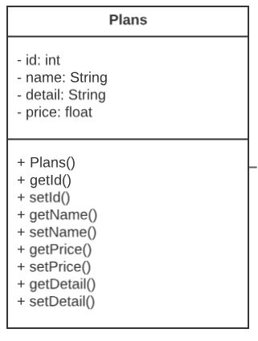

# Capítulo III: Arquitectura
## 3.1. Product design
### 3.1.1. Style Guidelines
#### 3.1.1.1. General Style Guidelines
### 3.1.2. Information Architecture
#### 3.1.2.1. Organuzation Systems
#### 3.1.2.2. Labelling Systems
#### 3.1.2.3. SEO Tags and Meta Tags
#### 3.1.2.4. Searching Systems
#### 3.1.2.5. Nagivation Systems
### 3.1.3. Landing Page UI Design

#### 3.1.3.1. Landing Page Wireframe

**Landing Page para Desktop Web Browser**

**Landing Page para Mobile Web Browser**

#### 3.1.3.2. Landing Page Mock-up
**Landing Page para Desktop Web Browser**

**Lading page para Mobile Web Browser**

### 3.1.4. Mobile Applications UX/UI Design
#### 3.1.4.1. Mobile Applications Wireframes

#### 3.1.4.2. Mobile Applications Wireflow Diagram

**User goal: Registro de usuario en la aplicación.**

**User goal: Búsqueda y filtrado de espacios.**

**User goal: Calificaciones y comentarios sobre espacios.**

**User goal: Comunicación directa con propietarios.**

**User goal: Registro de espacio sencillo.**

#### 3.1.4.3. Mobile Applications Mock-ups

#### 3.1.4.4. Mobile Applications User Flow Diagram

**User goal: Creación de cuenta**

**Given** que el usuario ha ingresado sus datos de registro correctamente,
**When** el usuario hace clic en el botón "Registrarse",
**Then** la cuenta del usuario se crea exitosamente y se le redirige a la página de inicio.

**User goal: Inicializacion de sesión**

Explicación del flujo: El proceso comienza con el usuario accediendo a la aplicación desplegada. Luego, se le presentará un formulario en pantalla donde deberá ingresar su correo electrónico y contraseña para iniciar sesión. Si los datos son válidos, el sistema lo redirigirá a la página principal del aplicativo. En caso contrario, permanecerá en la página de inicio de sesión y se le pedirá que vuelva a ingresar sus credenciales.

 

**User goal: Visualización de perfil**

Explicación del flujo: En la aplicación, siempre se mostrará una barra de navegación en la parte inferior. Cuando el usuario haga clic en "perfil", que están ubicados en el extremo inferior derecho de la barra de navegación, podrá acceder a su perfil de usuario y operaciones que puede hacer.

#### 3.1.4.5. Mobile Applications Prototyping
## 3.2. Architecture Overview

## 3.2. Architecture Overview
### 3.2.1. Domain-Driven Software Architecture
A continuación se visualizarán los diagramas C4.
#### 3.2.1.1. Software Architecture Context Level Diagram
Se puede visualizar el diagrama de contexto que representa un panorama general de la comunicación entre nuestros segmentos objetivo y la aplicación.

#### 3.2.1.2. Software Architecture Container Level Diagram
En este diagrama se puede apreciar el funcionamiento que tendrá la aplicación y las relaciones con los bounded context correspondientes, se busca organizarlos de tal forma que no generen dependencias fuertes que perjudiquen migraciones a future.

#### 3.2.1.3. Software Architecture Components Diagram
En este diagrama se presenta de forma detallada las conexiones entre controllers, services y repositories de las entidades que contiene el bounded context.

<strong>User Context</strong>

<strong>Subscription Context</strong>

<strong>Space Context</strong>

<strong>CreateReservation Context</strong>

<strong>Reservations Context</strong>

### 3.2.2. Software Object-Oriented Design
#### 3.2.2.1. Class Diagrams

#### 3.2.2.2. Class Dictionary
<table style="text-aling:center">
    <thead>
        <tr>
            <th>Clase</th>
            <th>Descripción</th>
        </tr>
    </thead>
    <body>
        <tr>
            <td> 
            
            </td>
            <td>Es la clase padre de las clases Organizer y Owner, es la encargada de almacenas los datos del usuario</td>
        </tr>
        <tr>
            <td> 
            
            </td>
            <td>La clase Owner hereda de la clase User. Representa a los propietarios de los espacios que pueden ser alquilados para eventos.</td>
        </tr>
        <tr>
            <td> 
            
            </td>
            <td>La clase Organizer hereda de la clase User. Representa a los organizadores de eventos que buscan y reservan espacios para sus eventos.</td>
        </tr>
        <tr>
            <td> 
            
            </td>
            <td>Gestiona las reservas realizadas por organizadores para espacios de eventos específicos.</td>
        </tr>
        <tr>
            <td> 
            
            </td>
            <td>Representa los espacios físicos disponibles para alquiler. Proporciona información detallada sobre el espacio, como ubicación, capacidad y características.</td>
        </tr>
        <tr>
            <td> 
            
            </td>
            <td>Representa los pagos asociados a las reservas de espacios de evento. Registra información sobre el monto, la fecha y el estado de los pagos realizados.</td>
        </tr>
        <tr>
            <td> 
            
            </td>
            <td>Representa las suscripciones de los propietarios a planes de servicio que ofrecen beneficios adicionales.</td>
        </tr>
        <tr>
            <td> 
            
            </td>
            <td>Define los diferentes niveles de suscripción disponibles para los propietarios de espacios.</td>
        </tr>
    </body>
</table>    

#### 3.2.2.3. Database Design

#### 3.2.2.4. Database Diagram

## [Conclusiones](#conclusiones)
## [Bibliografía](#bibliografía)
## [Anexos](#anexos)

