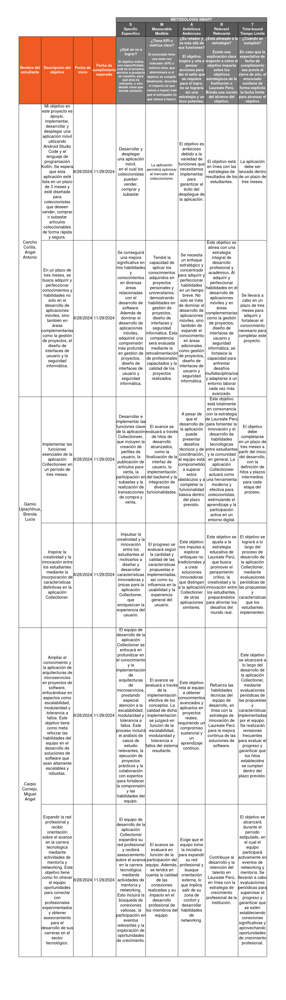

# COURSE PROJECT

    <strong>Universidad Peruana de Ciencias Aplicadas</strong> 
    </img> 
    <strong>Ingeniería de Software</strong> 
    <strong>Aplicaciones para Dispositivos Móviles - WV61</strong> 
    <strong>Profesor: Jorge Luis Mayta Guillermo</strong> 
     INFORME

    <strong>Startup:  </strong> 
    <strong>Producto: "" </strong>

    <h3 align="center">Team Members:</h3>
    

     <table align="center">
        <tr>
            <th style="text-align:center;">Member</th>
            <th style="text-align:center;">Code</th>
        </tr>
        <tr>
            <td>Cancho Corilla, Angel Antonio</td>
            <td>U201721995</td>
        </tr>
        <tr>
            <td>Gamio Upiachihua, Brenda Lucía</td>
            <td>U202120344</td>
        </tr>
        <tr>
            <td>Carpio Cornejo, Miguel Ángel</td>
            <td>U20221c360</td>
        </tr>       
    </table>

    <strong> 2024 - 2</strong>

 

---

# Registro de Versiones del Informe
<table >
        <tr>
            <th style="text-align:center;">Versión</th>
            <th style="text-align:center;">Fecha</th>
            <th style="text-align:center;">Autor</th>
            <th style="text-align:center;">Descripción de la modificación</th>
        </tr>
        <tr>
            <td align = "center">TB1</td>
            <td>27/08/2024</td>
            <td>Cancho Corilla, Angel Antonio  Carpio Cornejo, Miguel Ángel  Gamio Upiachihua, Brenda Lucía 
            <td>
                 Actualización del informe  
                 Entrevista 
                 Diseño de entrevista 
                 Startup profile 
                 Lean UX Process 
                 Needfinding Competidores 
                 
            </td>
        </tr>
        <tr>
            <td align = "center"></td>
            <td></td>
            <td></td>
            <td></td>
        </tr>
        <tr>
            <td align = "center"></td>
            <td></td>
            <td></td>
            <td></td>
        </tr>
        <tr>
            <td align = "center"></td>
            <td></td>
            <td></td>
            <td></td>
        </tr>
    <table>

---

 

# Project Report Collaboration Insights
TB1: Las tareas asignadas para la entrega TB1 se han completado y están documentadas en el siguiente repositorio de Github perteneciente a la organización del equipo: [Repositorio Github](https://github.com/Aplicaciones-Moviles-WV61-Grupo4/Report).

Durante la preparación del informe, se llevaron a cabo las siguientes actividades:
- 

---

# Student Outcome

<table >
        <tr>
            <th style="text-align:center;">Criterio específico</th>
            <th style="text-align:center;">Acciones realizadas</th>
            <th style="text-align:center;">Conclusiones</th>
        </tr>
        <tr>
            <td align = "left"> Actualiza conceptos y conocimientos necesarios para su desarrollo profesional y en especial para su proyecto en soluciones de ingeniería de software.</td>
            <td align = "left">
            Cancho Corilla, Angel Antonio: 
                Se llevaron a cabo reuniones tanto presenciales como virtuales para seleccionar la problemática a tratar. Durante estas reuniones, se establecieron horarios específicos, se programaron encuentros futuros y se asignaron responsabilidades. 
             Carpio Cornejo, Miguel Ángel 
                Se realizaron sesiones de brainstorming y análisis crítico para identificar posibles soluciones innovadoras a la problemática seleccionada. Estas sesiones permitieron una mayor colaboración entre los miembros del equipo, promoviendo la creatividad y la generación de ideas. Además, se crearon documentos     detallados con las estrategias y pasos a seguir para asegurar una implementación efectiva del proyecto.  
             Gamio Upiachihua, Brenda Lucía: 
            Para la primera entrega, se comenzó coordinando, planificando y definiendo el alcance de nuestra propuesta. Esto proporciona una base más sólida para la definición y ejecución técnica del proyecto.
            </td>
            <td>Se destaca la importancia de mantener actualizados los conocimientos y conceptos necesarios para el desarrollo profesional, especialmente en el área de soluciones de software. Un enfoque metodológico y colaborativo, como se menciona en las conclusiones, representa una práctica eficaz para el desarrollo de proyectos en este sector, garantizando el uso de las mejores prácticas y herramientas disponibles para cumplir con los objetivos establecidos.</td>  
        </tr>  
        <tr>
            <td align = "left"> Reconoce la necesidad del aprendizaje permanente para el desempeño profesional y el desarrollo de proyectos en soluciones de tecnologías de ingeniería de software.</td>
            <td align = "left">
            Cancho Corilla, Angel Antonio: 
                En el proceso de entrega, se llevó a cabo una investigación y consulta sobre la problemática abordada, con el objetivo de recopilar y organizar la información relevante de manera estructurada y coherente. 
             Carpio Cornejo, Miguel Ángel 
                Durante la fase de desarrollo, se implementó un enfoque iterativo, realizando pruebas periódicas y evaluaciones del progreso del proyecto. Esto permitió identificar y corregir posibles fallos en etapas tempranas, asegurando la calidad y efectividad de la solución propuesta. Además, se promovió la retroalimentación constante entre los miembros del equipo, lo que contribuyó a un proceso de desarrollo más colaborativo y eficiente.  
             Gamio Upiachihua, Brenda Lucía: 
            Nos basamos en proyectos anteriores para aplicar la mejora continua y evitar errores del pasado, con el objetivo de lograr un proyecto superior a los anteriores y ejecutarlo de manera más fluida.
            </td>
            <td>Se enfatiza la relevancia del aprendizaje continuo en el desarrollo profesional y en los proyectos de soluciones de software. La investigación constante, la adopción de herramientas actualizadas y el análisis de experiencias previas reflejan un compromiso con el aprendizaje permanente, lo cual es crucial para mejorar continuamente el desempeño y la calidad de los proyectos.</td>  
        </tr>  
            

</td>

</table>
 

---

# Objetivos SMART:

---

# Contenido 
## Tabla de contenidos
### [Registro de versiones del informe](#registro-de-versiones-del-informe)
### [Project Report Collaboration Insights](#project-report-collaboration-insights)
### [Student Outcome](#student-outcome)
## [Capítulo I: Introducción](#capítulo-i-introducción)
- [1.1. Startup Profile](#11-startup-profile)
  - [1.1.1. Descripción de la Startup](#111-descripción-de-la-startup)
  - [1.1.2. Perfiles de integrantes del equipo](#112-perfiles-de-integrantes-del-equipo)
- [1.2. Solution Profile](#12-solution-profile)
  - [1.2.1 Antecedentes y problemática](#121-antecedentes-y-problemática)
  - [1.2.2 Lean UX Process](#122-lean-ux-process)
    - [1.2.2.1. Lean UX Problem Statements](#1221-lean-ux-problem-statements)
    - [1.2.2.2. Lean UX Assumptions](#1222-lean-ux-assumptions)
    - [1.2.2.3. Lean UX Hypothesis Statements](#1223-lean-ux-hypothesis-statements)
    - [1.2.2.4. Lean UX Canvas](#1224-lean-ux-canvas)
- [1.3. Segmentos objetivo](#13-segmentos-objetivo)
## [Capítulo II: Requirements Elicitation & Analysis](#capítulo-ii-requirements-elicitation--analysis)
- [2.1. Competidores](#21-competidores)
  - [2.1.1. Análisis competitivo](#211-análisis-competitivo)
  - [2.1.2. Estrategias y tácticas frente a competidores](#212-estrategias-y-tácticas-frente-a-competidores)
- [2.2. Entrevistas](#22-entrevistas)
  - [2.2.1. Diseño de entrevistas](#221-diseño-de-entrevistas)
  - [2.2.2. Registro de entrevistas](#222-registro-de-entrevistas)
  - [2.2.3. Análisis de entrevistas](#223-análisis-de-entrevistas)
- [2.3. Needfinding](#23-needfinding)
  - [2.3.1. User Personas](#231-user-personas)
  - [2.3.2. User Task Matrix](#232-user-task-matrix)
  - [2.3.3. User Journey Mapping](#233-user-journey-mapping)
  - [2.3.4. Empathy Mapping](#234-empathy-mapping)
  - [2.3.5. As-is Scenario Mapping](#235-as-is-scenario-mapping)
- [2.4. Ubiquitous Language](#24-ubiquitous-language)
  ## [Capítulo III: Requirements Specification](#capítulo-iii-requirements-specification)
- [3.1. To-Be Scenario Mapping](#31-to-be-scenario-mapping)
- [3.2. User Stories](#32-user-stories)
- [3.3. Impact Mapping](#33-impact-mapping)
- [3.4. Product Backlog](#34-product-backlog)
## [Capítulo IV: Product Design](#capítulo-iv-product-design)
- [4.1. Style Guidelines](#41-style-guidelines)
  - [4.1.1. General Style Guidelines](#411-general-style-guidelines)
  - [4.1.2. Web Style Guidelines](#412-web-style-guidelines)
- [4.2. Information Architecture](#42-information-architecture)
  - [4.2.1. Organization Systems](#421-organization-systems)
  - [4.2.2. Labeling Systems](#422-labeling-systems)
  - [4.2.3. SEO Tags and Meta Tags](#423-seo-tags-and-meta-tags)
  - [4.2.4. Searching Systems](#424-searching-systems)
  - [4.2.5. Navigation Systems](#425-navigation-systems)
- [4.3. Landing Page UI Design](#43-landing-page-ui-design)
  - [4.3.1. Landing Page Wireframe](#431-landing-page-wireframe)
  - [4.3.2. Landing Page Mock-up](#432-landing-page-mock-up)
- [4.4. Web Applications UX/UI Design](#44-web-applications-uxui-design)
  - [4.4.1. Web Applications Wireframes](#441-web-applications-wireframes)
  - [4.4.2. Web Applications Wireflow Diagrams](#442-web-applications-wireflow-diagrams)
  - [4.4.3. Web Applications Mock-ups](#443-web-applications-mock-ups)
  - [4.4.4. Web Applications User Flow Diagrams](#444-web-applications-user-flow-diagrams)
- [4.5. Web Applications Prototyping](#45-web-applications-prototyping)
- [4.6. Domain-Driven Software Architecture](#46-domain-driven-software-architecture)
  - [4.6.1. Software Architecture Context Diagram](#461-software-architecture-context-diagram)
  - [4.6.2. Software Architecture Container Diagrams](#462-software-architecture-container-diagrams)
  - [4.6.3. Software Architecture Components Diagrams](#463-software-architecture-components-diagrams)
- [4.7. Software Object-Oriented Design](#47-software-object-oriented-design)
  - [4.7.1. Class Diagrams](#471-class-diagrams)
  - [4.7.2. Class Dictionary](#472-class-dictionary)
- [4.8. Database Design](#48-database-design)
  - [4.8.1. Database Diagram](#481-database-diagram)
## [Capítulo V: Product Implementation, Validation & Deployment](#capítulo-v-product-implementation-validation--deployment)
- [COURSE PROJECT](#course-project)
- [Registro de Versiones del Informe](#registro-de-versiones-del-informe)
- [Project Report Collaboration Insights](#project-report-collaboration-insights)
- [Student Outcome](#student-outcome)
- [Contenido](#contenido)
  - [Tabla de contenidos](#tabla-de-contenidos)
    - [Registro de versiones del informe](#registro-de-versiones-del-informe-1)
    - [Project Report Collaboration Insights](#project-report-collaboration-insights-1)
    - [Student Outcome](#student-outcome-1)
  - [Capítulo I: Introducción](#capítulo-i-introducción)
  - [Capítulo II: Requirements Elicitation \& Analysis](#capítulo-ii-requirements-elicitation--analysis)
  - [Capítulo III: Requirements Specification](#capítulo-iii-requirements-specification)
  - [Capítulo IV: Product Design](#capítulo-iv-product-design)
  - [Capítulo V: Product Implementation, Validation \& Deployment](#capítulo-v-product-implementation-validation--deployment)
  - [Conclusiones](#conclusiones)
  - [Bibliografía](#bibliografía)
  - [Anexos](#anexos)
- [Capítulo I: Introducción](#capítulo-i-introducción-1)
  - [1.1. StartUp Profile](#11-startup-profile)
    - [1.1.1. Description de la StartUp](#111-description-de-la-startup)
    - [1.1.2. Perfiles de integrantes del equipo](#112-perfiles-de-integrantes-del-equipo)
  - [1.2. Solution Profile](#12-solution-profile)
    - [1.2.1. Antecedentes y problemática](#121-antecedentes-y-problemática)
    - [Antecedentes](#antecedentes)
    - [Problemáticas](#problemáticas)
      - [Técnica de las 5 'W's y 2 'H's](#técnica-de-las-5-ws-y-2-hs)
      - [What?](#what)
    - [When?](#when)
    - [Where?](#where)
    - [Why?](#why)
    - [How?](#how)
    - [How much?](#how-much)
    - [1.2.2. Lean UX Process](#122-lean-ux-process)
      - [1.2.2.1. Lean UX Problem Statements](#1221-lean-ux-problem-statements)
      - [1.2.2.2. Lean UX Assumptions](#1222-lean-ux-assumptions)
      - [1.2.2.3. Lean UX Hypothesis Statements](#1223-lean-ux-hypothesis-statements)
      - [1.2.2.4. Lean UX Canvas](#1224-lean-ux-canvas)
- [1.3. Segmentos Objetivo](#13-segmentos-objetivo)
- [Capítulo II: Requirements Elicitation \& Analysis](#capítulo-ii-requirements-elicitation--analysis-1)
  - [2.1. Competidores](#21-competidores)
    - [2.1.1. Análisis competitivo](#211-análisis-competitivo)
    - [2.1.2. Estrategias y tácticas frente a competidores](#212-estrategias-y-tácticas-frente-a-competidores)
  - [2.2. Entrevistas](#22-entrevistas)
    - [2.2.1. Diseño de entrevistas](#221-diseño-de-entrevistas)
    - [2.2.2. Registro de entrevistas](#222-registro-de-entrevistas)
  - [Link del video con todas las entrevistas: https://upcedupe-my.sharepoint.com/:v:/g/personal/u202120344\_upc\_edu\_pe/EXNPFKACaqhMrla\_7xjSCtMBgAHuLpWOdgslbhB\_tDvdow?nav=eyJyZWZlcnJhbEluZm8iOnsicmVmZXJyYWxBcHAiOiJTdHJlYW1XZWJBcHAiLCJyZWZlcnJhbFZpZXciOiJTaGFyZURpYWxvZy1MaW5rIiwicmVmZXJyYWxBcHBQbGF0Zm9ybSI6IldlYiIsInJlZmVycmFsTW9kZSI6InZpZXcifX0%3D\&e=LujiaK](#link-del-video-con-todas-las-entrevistas-httpsupcedupe-mysharepointcomvgpersonalu202120344_upc_edu_peexnpfkacaqhmrla_7xjsctmbgahulpwodgslbhb_tdvdownaveyjyzwzlcnjhbeluzm8ionsicmvmzxjyywxbchaioijtdhjlyw1xzwjbchailcjyzwzlcnjhbfzpzxcioijtagfyzurpywxvzy1maw5riiwicmvmzxjyywxbchbqbgf0zm9ybsi6ildlyiisinjlzmvycmfstw9kzsi6inzpzxcifx03delujiak)
    - [2.2.3. Análisis de entrevistas](#223-análisis-de-entrevistas)
  - [2.3. Needfinding](#23-needfinding)
    - [2.3.1. User Personas](#231-user-personas)
    - [2.3.2. User Task Matrix](#232-user-task-matrix)
    - [2.3.3. User Journey Mapping](#233-user-journey-mapping)
    - [2.3.4. Empathy Mapping](#234-empathy-mapping)
    - [2.3.5. As-is Scenario Mapping](#235-as-is-scenario-mapping)
  - [2.4. Ubiquitous Language](#24-ubiquitous-language)
- [Capítulo III: Requirements Specification](#capítulo-iii-requirements-specification-1)
  - [3.1. To-Be Scenario Mapping](#31-to-be-scenario-mapping)
  - [3.2. User Stories](#32-user-stories)
  - [3.3. Impact Mapping](#33-impact-mapping)
  - [3.4. Product Backlog](#34-product-backlog)
- [Capítulo IV: Product Design](#capítulo-iv-product-design-1)
  - [4.1. Style Guidelines.](#41-style-guidelines)
    - [4.1.1. General Style Guidelines](#411-general-style-guidelines)
    - [4.1.2. Web Style Guidelines](#412-web-style-guidelines)
    - [4.2.1. Organization Systems](#421-organization-systems)
    - [4.2.2. Labeling Systems](#422-labeling-systems)
    - [4.2.3. SEO Tags and Meta Tags](#423-seo-tags-and-meta-tags)
    - [4.2.4. Searching Systems](#424-searching-systems)
    - [4.2.5. Navigation Systems](#425-navigation-systems)
  - [4.3. Landing Page UI Design](#43-landing-page-ui-design)
    - [4.3.1. Landing Page Wireframe](#431-landing-page-wireframe)
    - [4.3.2. Landing Page Mock-up](#432-landing-page-mock-up)
  - [4.4. Web Applications UX/UI Design](#44-web-applications-uxui-design)
    - [4.4.1. Web Applications Wireframes](#441-web-applications-wireframes)
    - [4.4.2. Web Applications Wireflow Diagrams](#442-web-applications-wireflow-diagrams)
    - [4.4.3. Web Applications Mock-ups](#443-web-applications-mock-ups)
    - [4.4.4. Web Applications User Flow Diagrams](#444-web-applications-user-flow-diagrams)
  - [4.5. Web Applications Prototyping](#45-web-applications-prototyping)
  - [4.6. Domain-Driven Software Architecture](#46-domain-driven-software-architecture)
    - [4.6.1. Software Architecture Context Diagram](#461-software-architecture-context-diagram)
    - [4.6.2. Software Architecture Container Diagrams](#462-software-architecture-container-diagrams)
    - [4.6.3. Software Architecture Components Diagrams](#463-software-architecture-components-diagrams)
  - [4.7. Software Object-Oriented Design](#47-software-object-oriented-design)
    - [4.7.1. Class Diagrams](#471-class-diagrams)
    - [4.7.2. Class Dictionary](#472-class-dictionary)
  - [4.8. Database Design.](#48-database-design)
    - [4.8.1. Database Diagram.](#481-database-diagram)
- [Capítulo V: Product Implementation, Validation \& Deployment](#capítulo-v-product-implementation-validation--deployment-1)
  - [5.1. Software Configuration Management](#51-software-configuration-management)
    - [5.1.1. Software Development Environment Configuration](#511-software-development-environment-configuration)
    - [5.1.2. Source Code Management](#512-source-code-management)
    - [5.1.3. Source Code Style Guide \& Conventions](#513-source-code-style-guide--conventions)
    - [5.1.4. Software Deployment Configuration](#514-software-deployment-configuration)
  - [5.2. Landing Page, Services \& Applications Implementation](#52-landing-page-services--applications-implementation)
    - [5.2.1. Sprint 1](#521-sprint-1)
      - [5.2.1.1. Sprint Planning 1](#5211-sprint-planning-1)
      - [5.2.1.2. Sprint Backlog 1](#5212-sprint-backlog-1)
      - [5.2.1.3. Development Evidence for Sprint Review.](#5213-development-evidence-for-sprint-review)
      - [5.2.1.4. Testing Suite Evidence for Sprint Review](#5214-testing-suite-evidence-for-sprint-review)
      - [5.2.1.5. Execution Evidence for Sprint Review](#5215-execution-evidence-for-sprint-review)
      - [5.2.1.6. Services Documentation Evidence for Sprint Review](#5216-services-documentation-evidence-for-sprint-review)
      - [5.2.1.7. Software Deployment Evidence for Sprint Review](#5217-software-deployment-evidence-for-sprint-review)
      - [5.2.1.8. Team Collaboration Insights during Sprint](#5218-team-collaboration-insights-during-sprint)
    - [5.2.2. Sprint 2](#522-sprint-2)
      - [5.2.2.1. Sprint Planning 2](#5221-sprint-planning-2)
      - [5.2.2.2. Sprint Backlog 2](#5222-sprint-backlog-2)
      - [5.2.2.3. Development Evidence for Sprint Review.](#5223-development-evidence-for-sprint-review)
      - [5.2.2.4. Testing Suite Evidence for Sprint Review](#5224-testing-suite-evidence-for-sprint-review)
      - [5.2.2.5. Execution Evidence for Sprint Review](#5225-execution-evidence-for-sprint-review)
      - [5.2.2.6. Services Documentation Evidence for Sprint Review](#5226-services-documentation-evidence-for-sprint-review)
      - [5.2.2.7. Software Deployment Evidence for Sprint Review](#5227-software-deployment-evidence-for-sprint-review)
      - [5.2.2.8. Team Collaboration Insights during Sprint](#5228-team-collaboration-insights-during-sprint)
    - [5.2.3. Sprint 3](#523-sprint-3)
      - [5.2.3.1. Sprint Planning 3](#5231-sprint-planning-3)
      - [5.2.3.2. Sprint Backlog 3](#5232-sprint-backlog-3)
      - [5.2.3.3. Development Evidence for Sprint Review.](#5233-development-evidence-for-sprint-review)
      - [5.2.3.4. Testing Suite Evidence for Sprint Review](#5234-testing-suite-evidence-for-sprint-review)
      - [5.2.3.5. Execution Evidence for Sprint Review](#5235-execution-evidence-for-sprint-review)
      - [5.2.3.6. Services Documentation Evidence for Sprint Review](#5236-services-documentation-evidence-for-sprint-review)
      - [5.2.3.7. Software Deployment Evidence for Sprint Review](#5237-software-deployment-evidence-for-sprint-review)
      - [5.2.3.8. Team Collaboration Insights during Sprint](#5238-team-collaboration-insights-during-sprint)
    - [5.2.4. Sprint 4](#524-sprint-4)
      - [5.2.4.1. Sprint Planning 4](#5241-sprint-planning-4)
      - [5.2.4.2. Sprint Backlog 4](#5242-sprint-backlog-4)
      - [5.2.4.3. Development Evidence for Sprint Review.](#5243-development-evidence-for-sprint-review)
      - [5.2.4.4. Testing Suite Evidence for Sprint Review](#5244-testing-suite-evidence-for-sprint-review)
      - [5.2.4.5. Execution Evidence for Sprint Review](#5245-execution-evidence-for-sprint-review)
      - [5.2.4.6. Services Documentation Evidence for Sprint Review](#5246-services-documentation-evidence-for-sprint-review)
      - [5.2.4.7. Software Deployment Evidence for Sprint Review](#5247-software-deployment-evidence-for-sprint-review)
      - [5.2.4.8. Team Collaboration Insights during Sprint](#5248-team-collaboration-insights-during-sprint)
  - [5.3 Validation Interviews](#53-validation-interviews)
    - [5.3.1 Diseño de Entrevistas](#531-diseño-de-entrevistas)
    - [5.3.2 Registro de Entrevistas](#532-registro-de-entrevistas)
  - [Link del video con todas las entrevistas de validación: https://upcedupe-my.sharepoint.com/:v:/g/personal/u201721995\_upc\_edu\_pe/EXKDndrj4WpAjZfTQz6uBukByI1I1\_del5CFGWq2SkxLBg?nav=eyJyZWZlcnJhbEluZm8iOnsicmVmZXJyYWxBcHAiOiJTdHJlYW1XZWJBcHAiLCJyZWZlcnJhbFZpZXciOiJTaGFyZURpYWxvZy1MaW5rIiwicmVmZXJyYWxBcHBQbGF0Zm9ybSI6IldlYiIsInJlZmVycmFsTW9kZSI6InZpZXcifX0%3D\&e=hizd6X](#link-del-video-con-todas-las-entrevistas-de-validación-httpsupcedupe-mysharepointcomvgpersonalu201721995_upc_edu_peexkdndrj4wpajzftqz6ubukbyi1i1_del5cfgwq2skxlbgnaveyjyzwzlcnjhbeluzm8ionsicmvmzxjyywxbchaioijtdhjlyw1xzwjbchailcjyzwzlcnjhbfzpzxcioijtagfyzurpywxvzy1maw5riiwicmvmzxjyywxbchbqbgf0zm9ybsi6ildlyiisinjlzmvycmfstw9kzsi6inzpzxcifx03dehizd6x)
    - [5.3.3. Evaluaciones según heurísticas](#533-evaluaciones-según-heurísticas)
  - [5.4. Video About-the-Product](#54-video-about-the-product)
- [Conclusiones](#conclusiones-1)
  - [Video About-the-Team](#video-about-the-team)
- [Bibliografía](#bibliografía-1)
- [Anexos](#anexos-1)
 # Capítulo I: Introducción

## 1.1. StartUp Profile
En esta sección se describirá la descripción de la Starup y el caso de negocio.

### 1.1.1. Description de la StartUp
NestHub es una startup tecnológica fundada en 2024 con el objetivo de revolucionar la industria de los alquileres para eventos. Nuestra plataforma, diseñada por un equipo de jóvenes ingenieros de software, ofrece una amplia gama de funcionalidades, como: búsqueda avanzada, reservas en línea, gestión de pagos, calificaciones y reseñas.

Para esto:

- **Misión:**
Nuestra misión es crear una comunidad global de propietarios y organizadores de eventos, facilitando la conexión entre ellos y fomentando relaciones duraderas a través de una plataforma confiable y transparente.

- **Visión:**
Nuestra visión es ser la plataforma preferida por los organizadores de eventos a nivel mundial, ofreciéndoles una amplia gama de opciones de espacios y herramientas para planificar y ejecutar eventos exitosos.

### 1.1.2. Perfiles de integrantes del equipo

<table style="text-aling:center">
    <thead>
        <tr>
            <th>Integrantes</th>
            <th>Descripcion</th>
            <th>Conocimientos</th>
        </tr>
    </thead>
    <body>
        <tr>
            <td> 
            
              Miguel Ángel Carpio Cornejo
            </td>
            <td> Estudiante de 6to ciclo de la carrera de ingeniería de Software, tengo 20 años y me gusta realizar proyector bien estructurados para una buena comprensión del mismo. </td>
            <td>Conocimientos en HTML, python, java, C++, SQL. </td>
        </tr>
        <tr>
            <td> 
            
              Angel Antonio Cancho Corilla
            </td>
            <td> Estudiante de 6to ciclo de la carrera de ingeniería de Software. Me gusta mantenerme actualizado y explorar nuevas formas de facilitar las tareas 
y alcanzar los objetivos de manera más eficiente.</td>
            <td> Conocimientos en HTML, CSS, Java, Typescript, C++ y SQL</td>
        </tr>
        <tr>
            <td> 
            
             Brenda Lucía Gamio Upiachihua
            </td>
            <td>Estudiante del 6to ciclo de la carrera de Ingeniería de Software. Soy alguien responsable y dedicada que le gusta aprendere e investigar más cosas para facilitar el trabajo. </td>
            <td>Conocimientos en HTML, CSS, JavaScript, C++, Python y base de datos SQL y No SQL. </td>
        </tr>
    </body>
</table>    

## 1.2. Solution Profile
A continuación, describiremos las características principales y beneficios de nuestra plataforma, así como el modelo de negocio que sustenta su funcionamiento.

**Product Name:** NestHub

**Product Description:** NestHub es una plataforma tecnológica que conecta a propietarios de espacios con organizadores de eventos. A través de un modelo de suscripción para propietarios, ofrecemos funcionalidades avanzadas y mayor visibilidad en nuestra plataforma. Los organizadores, por su parte, acceden de forma gratuita a una amplia variedad de espacios y herramientas para gestionar sus eventos de manera eficiente. Nuestro objetivo es crear una comunidad próspera y facilitar la organización de eventos exitosos.

### 1.2.1. Antecedentes y problemática

### Antecedentes

La creciente digitalización de la sociedad peruana ha revolucionado la forma en que interactuamos con los servicios, y el sector de eventos no es la excepción. Hoy en día, los peruanos están cada vez más acostumbrados a reservar y adquirir productos y servicios a través de plataformas digitales, tanto en computadoras como en dispositivos móviles.

De hecho, la INEI muestra el aumento de personas que accedieron a internet, estadísticamente, entre el 2019 hasta el 2022.

    "En los primeros tres meses del 2022, 73 de cada 100 personas de 6 y más años de edad accedieron a Internet en el país, cifra que muestra un crecimiento de 5,1 y 17,7 puntos porcentuales al compararla con igual trimestre de los años 2021 (67,4%) y 2019 (54,8%), respectivamente." (INEI, 2022)

Viendo la señalación del incremento del uso del internet, nosotros pensamos que NestHub se posiciona como la solución ideal para satisfacer esta demanda. Al ofrecer una plataforma digital intuitiva y completa, simplificamos el proceso de búsqueda y reserva de espacios para eventos, brindando a nuestros usuarios una experiencia personalizada y eficiente. Además, nos apoyamos en las últimas tendencias tecnológicas para garantizar la seguridad de las transacciones y la satisfacción de nuestros clientes.

### Problemáticas
#### 5 'W's y 2 'H's

### What
- **¿Cuál es el problema?**  
  Organizar un evento, ya que esto implica una ardua tarea al momento de buscar el espacio ideal. La falta de una plataforma unificada dificulta la conexión entre propietarios y organizadores, generando retrasos y frustración en el proceso.

### When
- **¿Cuándo ocurre el problema**  
  Tanto propietarios como organizadores de eventos se enfrentan constantemente al desafío de conectar sus necesidades. Ya sea para eventos planificados con meses de anticipación o para aquellos que requieren una solución inmediata, la búsqueda de espacios adecuados es una necesidad recurrente.

- **¿Cuándo utiliza el cliente el producto?**  
  Desde la planificación de grandes eventos con meses de anticipación hasta la búsqueda de última hora de un lugar para una reunión pequeña, la necesidad de encontrar el espacio adecuado es constante y diversa.

### Where
- **¿Dónde está el usuario cuando usa el producto?**  
  El usuario estaría principalmente en el aplicativo móvil.

- **¿Dónde surge el problema?**  
  La principal problemática radica en la complejidad de hallar y reservar espacios que cumplan con los requisitos de un evento, tanto si se planea con anticipación como si se necesita una solución inmediata. Además de poder encontrar un espacio que se ajuste al presupuesto, la capacidad y las características requeridas para un evento específico puede ser una tarea desafiante.

### Why
- **¿Por qué ocurre este problema?**  
  La carencia de una plataforma única que conecte a quienes ofrecen espacios para eventos con quienes los buscan genera una serie de inconvenientes. La búsqueda se vuelve engorrosa, lo que a menudo conduce a la frustración de ambas partes y a la pérdida de oportunidades de negocio.

### How

- **¿Cómo prefieren los clientes acceder a nuestro servicio?**  
  Los usuarios prefieren acceder al producto a través de un aplicativo móvil por lo conveniente que es usar un app desde su celular, en vez de usar un navegador web.

- **¿Cómo serían las condiciones en la que los usuarios usarían nuestro producto?**  
  En AlquilaFácil, organizadores de eventos, ya sean sociales o corporativos, encuentran el espacio perfecto para sus celebraciones. Al mismo tiempo, propietarios de espacios pueden conectar con una amplia audiencia y rentabilizar sus instalaciones.

### How much
Nuestros planes de suscripción en AlquilaFácil ofrecen una gama de beneficios adicionales para aquellos que buscan una experiencia más completa y pueden adaptarse a las necesidades de cada usuario. Desde opciones gratuitas hasta planes premium con beneficios adicionales, encontrarás el plan perfecto para tu presupuesto y requerimientos.

### 1.2.2. Lean UX Process
En esta seccióm, utilizaremos el enfoque Lean UX para diseñar nuestro producto de software y asegurarnos de que se ajuste a nuestra estrategia de negocio. Al priorizar las necesidades de nuestros usuarios, podremos desarrollar una solución que genere valor y contribuya al éxito de nuestra empresa.

#### 1.2.2.1. Lean UX Problem Statements
1. **Problema:**
   - Los organizadores de eventos enfrentan dificultades para encontrar y reservar espacios adecuados para sus eventos de forma eficiente, ya que no existe una plataforma centralizada que reúna todas las opciones disponibles y facilite este proceso.
  
   - Los propietarios de espacios tienen dificultades para conectar con organizadores de eventos interesados en sus instalaciones debido a la falta de visibilidad y herramientas adecuadas para la gestión de reservas.
2. **Declaración del problema:** La falta de una plataforma unificada genera frustración y retrasos para ambos grupos de usuarios, lo que lleva a una experiencia negativa y la pérdida de oportunidades de negocio.
3. **Solución propuesta:** Una plataforma que facilite la búsqueda, comparación, reserva y pago de espacios para eventos en un solo lugar, reduciendo el tiempo y el esfuerzo necesario para ambas partes.

#### 1.2.2.2. Lean UX Assumptions

1. **Business Assumptions:**
   - La búsqueda de espacios para eventos es un proceso frustante y consume mucho tiempo.
  
   - La falta de unificación en las opciones de búsqueda y reserva impide a los organizaciones de eventos encontrar opciones adecuadas rápidamente.

2. **Users Assumptions:** 
   - Los organizadores de eventos prefieren utilizar una aplicación móvil para buscar y reservar espacios, debido a la conveniencia de tener acceso instantáneo desde sus dispositivos.
  
   - Los propietarios de espacios desean aumentar la visibilidad de sus instalaciones y optimizar la gestión de reservas a través de herramientas digitales.
  
3. **Outcome Assumptions:**
   - Al ofrecer una plataforma que centralice las opciones de búsqueda y reserva de espacios para eventos, tanto organizadores como propietarios experimentarán una mejora en la eficiencia del proceso.
  
   - Una aplicación móvil que incluya búsqueda avanzada, gestión de pagos, calificaciones y reseñas atraerá tanto a organizadores como a propietarios de espacios.

#### 1.2.2.3. Lean UX Hypothesis Statements
- Creemos que al ofrecer una plataforma unificada de búsqueda y reserva de espacios, reduciremos el tiempo de búsqueda para los organizadores de eventos en un 50% durante los primeros tres meses.

- Creemos que al implementar una aplicación móvil con funciones avanzadas (búsqueda avanzada, gestión de pagos, calificaciones y reseñas), aumentaremos el uso de la plataforma por parte de organizadores de eventos en un 30% durante los primeros seis meses.
  
- Creemos que los organizadores de eventos que actualmente utilizan métodos tradicionales (boca a boca, sitios web individuales, etc.) preferirán nuestra plataforma para sus futuras búsquedas y reservas, ya que será más conveniente y eficiente.
  
- Creemos que los propietarios de espacios que desean maximizar sus ingresos y la ocupación de sus instalaciones se suscribirán a nuestros planes premium para obtener una mayor visibilidad y herramientas avanzadas.

#### 1.2.2.4. Lean UX Canvas

<em> Fuente: Elaboración propia. </em>

# 1.3. Segmentos Objetivo

En esta sección, identificamos los segmentos específicos de clientes a los que AlquilaFácil se dirige, considerando características demográficas, comportamientos y necesidades comunes.

- **Organizadores de Eventos:**  
  Se trata de personas que planifican eventos sociales, como bodas, cumpleaños, reuniones familiares, entre otros, así como individuos que organizan eventos de forma regular, ya sean sociales o corporativos.

  - **Características:** Buscan espacios que se ajusten a sus necesidades particulares, tales como capacidad, ubicación, y servicios disponibles. Además, realizan múltiples reservas a lo largo del año.
  - **Necesidades:** Requieren una plataforma que facilite la búsqueda y reserva de espacios, con acceso a información detallada sobre instalaciones y servicios, así como programas de fidelización, descuentos por reservas frecuentes y acceso prioritario a espacios exclusivos.
  
- **Propiedades de Espacios para eventos:**  
  Incluye a personas o empresas que poseen espacios adecuados para eventos, como salones de banquetes, jardines, locales comerciales, entre otros.

  - **Características:** Cuentan con una variedad de espacios con diferentes capacidades y atributos.
  - **Necesidades:** Buscan una promoción eficaz de sus espacios, una gestión eficiente de las reservas y acceso a herramientas para administrar sus listados y la planificación de eventos.

## [Conclusiones](#conclusiones)
## [Bibliografía](#bibliografía)
## [Anexos](#anexos)

