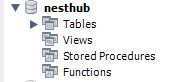
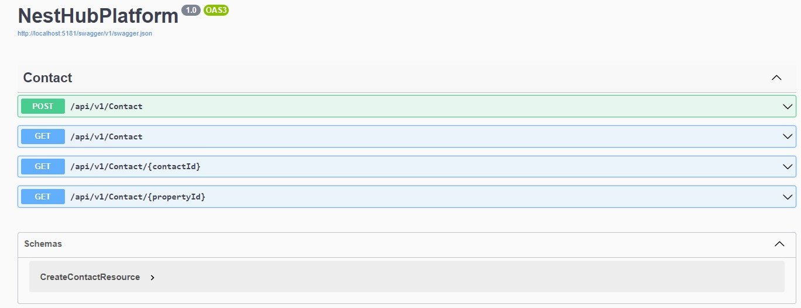
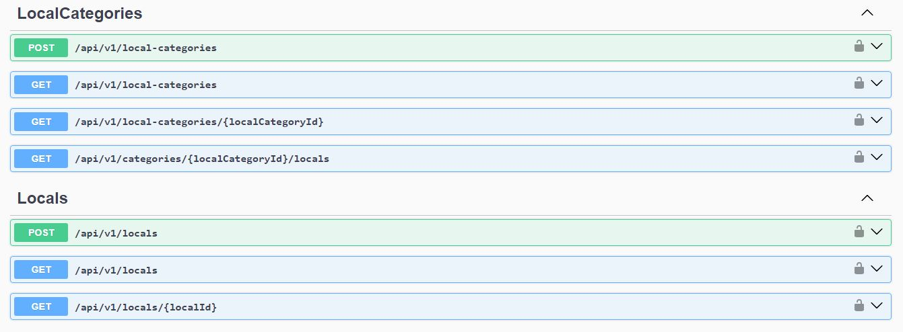
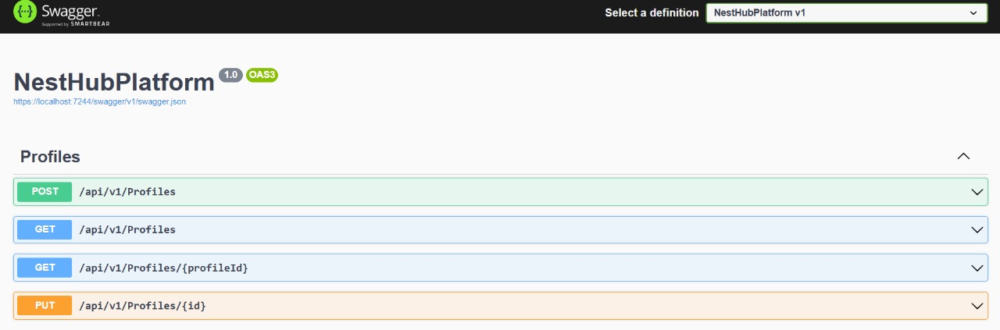
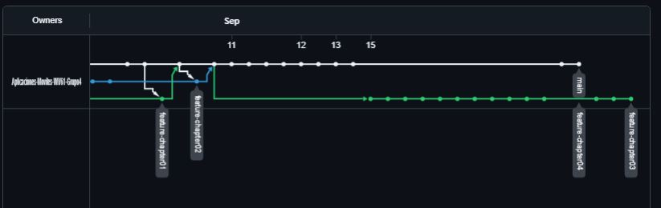
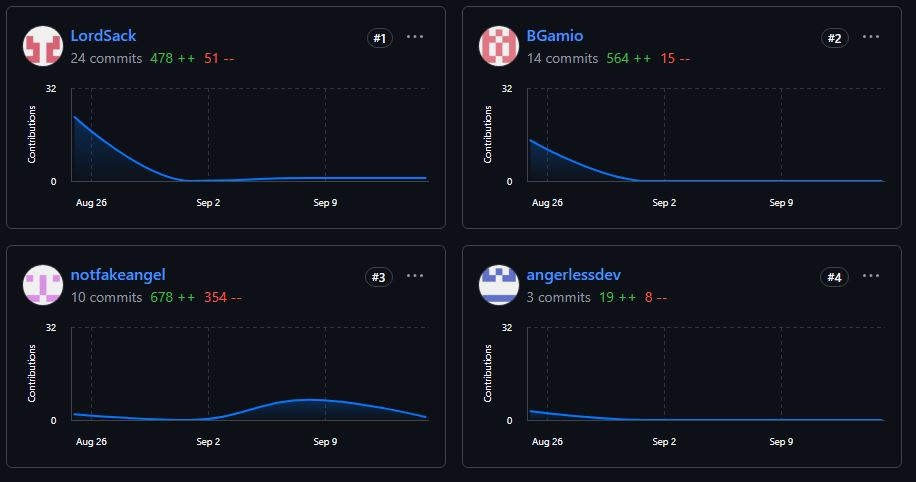

# Capítulo IV: Backend Product Implementation & Validation
## 4.1. Software Configuration Management
### 4.1.1. Software Development Environment Configuration
A continuación se presenta un resumen de las herramientas utilizadas en el proyecto, que permiten al equipo avanzar en cada aspecto del trabajo:

- Rider: IDE que utilizamos para el desarrollo backend en .NET y C#.    
- GitHub: Repositorio en la nube para colaboración en proyectos.
- Swagger: Herramienta para documentar y probar las APIs desarrolladas en el backend.
- MySQL Workbench: Herramienta gráfica para administrar la base de datos MySQL, utilizada para modelar, consultar y gestionar la base de datos del backend.
### 4.1.2. Source Code Management
Trabajamos con dos ramas principales:

- Main: La rama principal utilizada para publicar nuestras versiones oficiales.
- Default: Rama por defecto que utilizamos para consolidar los desarrollos generales del proyecto.
- feature/Locals: Rama dedicada al desarrollo de las funcionalidades relacionadas con la gestión de locales.
- feature/contacts: Rama enfocada en la implementación de las funcionalidades relacionadas con la gestión de contactos.
- feature/profiles: Rama destinada al desarrollo e integración de las funcionalidades de perfiles de usuarios.
### 4.1.3. Source Code Style Guide & Conventions
Para realizar nuestro proyecto, hemos utilizado:

- Tecnologías: Utilizamos lenguajes y tecnologías como C# y ASP.NET Core para el desarrollo del backend de nuestra aplicación.
- Herramientas: Optamos por herramientas recomendadas y ampliamente utilizadas en el desarrollo backend, como Rider para el entorno de desarrollo integrado (IDE) y Workbench para la gestión de bases de datos.
  
### 4.1.4. Software Deployment Configuration
A continuación, explicamos el proceso de implementación del backend en GitHub:

- Primero, creamos un repositorio remoto en GitHub para alojar el código del backend.
- Inicializamos el repositorio localmente en nuestro entorno de desarrollo con el comando git init.
- Luego, conectamos el repositorio local al repositorio remoto de GitHub utilizando el comando git remote add origin [URL].
- Subimos los archivos y cambios al repositorio remoto con git push -u origin main (o la rama en la que estemos trabajando).
- Configuramos las herramientas de integración continua y cualquier ajuste necesario para asegurar el despliegue automático y el correcto funcionamiento del backend.
- Finalmente, verificamos que el despliegue del backend se haya realizado exitosamente y que la aplicación funcione según lo esperado.
  
## 4.2. Software Development & Implementation
### 4.2.1. Sprint 
#### 4.2.1.1. Sprint Planning
#### 4.2.1.2. Sprint Backlog
### 4.2.1. Sprint 1
#### 4.2.1.1. Sprint Planning 1
<table style="text-align: center;">
    <tbody>
        <tr>
            <td colspan="1">Sprint #</td>
            <td colspan="1">Sprint 1</td>
        </tr>
        <tr>
            <td colspan="2">Sprint Planning Background</td>
        </tr>
        <tr>
            <td colspan="1">Date</td>
            <td colspan="1">05/09/2024</td>
        </tr>
        <tr>
            <td colspan="1">Location</td>
            <td colspan="1">Microsoft Teams (Reuniones Virtuales)</td>
        </tr>
        <tr>
            <td colspan="1">Prepared By</td>
            <td colspan="1">Brenda Gamio</td>
        </tr>
        <tr>
            <td colspan="1">Attendees (to planning meeting)</td>
            <td colspan="1">- Brenda Gamio<br>
                - Angel Cancho<br>
                - Miguel Carpio<br></td>
        </tr>
        <tr>
            <td colspan="2">Sprint Goal & User Stories</td>
        </tr>
        <tr>
            <td colspan="1">Sprint 1 Goal</td>
            <td colspan="1">Avanzar en la implementación de los endpoints del backend.</td>
        </tr>
        <tr>
            <td colspan="1">Sprint 1 Velocity</td>
            <td colspan="1">No se puede calcular ya que la implementación de los endpoints del backend no tiene backlog items o story points.</td>
        </tr>
        <tr>
            <td colspan="1">Sum of Story Points</td>
            <td colspan="1">No se puede calcular ya que la implementación de los endpoints del backend no tiene story points.</td>
        </tr>
        <tr>
            <td colspan="1">Backend Progress</td>
            <td colspan="1">Avance del 30% en la implementación de los endpoints del backend.</td>
        </tr>
    </tbody>
</table>

#### 4.2.1.2. Sprint Backlog 1
<table>
	<tbody>
		<tr>
			<td>Sprint #</td>
			<td colspan="7">Sprint 3</td>
		</tr>
		<tr>
			<td colspan="2">User Story</td>
			<td colspan="6">Work - Item / Task</td>
		</tr>
		<tr>
			<td>Id</td>
			<td>Title</td>
			<td>Description</td>
			<td>Estimation (Hours)</td>
			<td>Assigned To</td>
			<td>Status (To-do / In-Process / To-Review / Done)</td>
		</tr>
		<tr>
			<td>EP10/US01</td>
			<td>Acceder a EndPoints</td>
			<td>Como desarrollador, quiero tener acceso a los endpoints de la aplicación para poder interactuar con ella.</td>
			<td>6</td>
			<td>All team members</td>
			<td>In-Process</td>
		</tr>
		<tr>
			<td>EP10/US02</td>
			<td>Registrar Subscripciones</td>
			<td>Como developer, quiero contar con un endpoint para poder registrar las subscripciones que tienen los usuarios.</td>
			<td>2</td>
			<td>Brenda Gamio</td>
			<td>Done</td>
		</tr>
		<tr>
			<td>EP10/US04</td>
			<td>Registrar Perfiles</td>
			<td>Como developer, quiero contar con un endpoint para poder registrar a los perfiles.</td>
			<td>2</td>
			<td>Angel Cancho</td>
			<td>Done</td>
		</tr>
		<tr>
			<td>EP10/US05</td>
			<td>Registrar Contactos</td>
			<td>Como developer, quiero contar con un endpoint para poder registrar los contactos.</td>
			<td>2</td>
			<td>Miguel Carpio</td>
			<td>Done</td>
		</tr>
		<tr>
			<td>EP10/US07</td>
			<td>Creación de persistencia de la entidad Subscription</td>
			<td>Como developer, quiero realizar la persistencia de la información para la entidad Subscription.</td>
			<td>2</td>
			<td>Brenda Gamio</td>
			<td>Done</td>
		</tr>
		<tr>
			<td>EP10/US08</td>
			<td>Creación de persistencia de la entidad Perfil</td>
			<td>Como developer, quiero implementar la persistencia de la información de la entidad Perfil para asegurar que los datos de los perfiles se almacenen de manera segura y estén disponibles cuando sea necesario.</td>
			<td>2</td>
			<td>Angel Cancho</td>
			<td>Done</td>
		</tr>
		<tr>
			<td>EP10/US09</td>
			<td>Creación de persistencia de la entidad Contacto</td>
			<td>Como developer quiero hacer persistir la información de la entidad Contacto para tener registrado.</td>
			<td>2</td>
			<td>Miguel Carpio</td>
			<td>Done</td>
		</tr>
		<tr>
			<td>EP10/US11</td>
			<td>Creación de resource de la entidad Subscription</td>
			<td>Como developer quiero devolver un resource de la información de la entidad Subscription para realizar consultas.</td>
			<td>2</td>
			<td>Brenda Gamio</td>
			<td>Done</td>
		</tr>
		<tr>
			<td>EP10/US12</td>
			<td>Creación de resource de la entidad Perfil</td>
			<td>Como developer quiero devolver un resource de la información de la entidad Perfil para realizar consultas.</td>
			<td>2</td>
			<td>Angel Cancho</td>
			<td>Done</td>
		</tr>
		<tr>
			<td>EP10/US13</td>
			<td>Creación de resource de la entidad Contacto</td>
			<td>Como developer quiero devolver un resource de la información de la entidad Contacto para realizar consultas.</td>
			<td>2</td>
			<td>Miguel Carpio</td>
			<td>Done</td>
		</tr>        
    </tbody>
</table>


#### 4.2.1.3. Development Evidence for Sprint Review

| Repository | Branch | Commit ID                                | Commit Message                            | Commit Message Body                    | Commited on (Date) |
|------------|--------|------------------------------------------|-------------------------------------------|----------------------------------------|--------------------|
| Backend    | main   | 5d3eede7981780e5bc96fa4067df4ff3f1472a85 | chore: initial commit                     | Initial setup                          | 14/09/2024         |
| Backend    | main   | 2200e6526ebdde4d400fcf5bab5720882cdb4596 | chore: added shared folder                | Added shared folder                    | 14/09/2024         |
| Backend    | main   | 7f30747276c3a935a9564e79489b82ae0ce7d645 | feat: add contacts service                | Added contacts service                 | 14/09/2024         |
| Backend    | main   | 798e808dfbc0c51da7f8a724727a1475ba356c8f | feat: added bounded context for local     | Added bounded context for local        | 14/09/2024         |
| Backend    | main   | c99c0683833aa5d576b9d939610afca73f7c96c4 | feat: added profiles bounded context      | Added profiles bounded context         | 14/09/2024         |

#### 4.2.1.4. Testing Suite Evidence for Sprint Review

Esta sección ha sido omitida porque aún no contamos con el conocimiento necesario para llevar a cabo pruebas automatizadas, las cuales están previstas para el próximo sprint.
#### 4.2.1.5. Execution Evidence for Sprint Review




#### 4.2.1.6. Services Documentation Evidence for Sprint Review

| Nombre del Endpoint         | Acciones Implementadas | Sintaxis de Llamada                                                   | Especificación de Parámetros                         | Ejemplo de Llamada                                                                                                                                                                                                                                                                                                             | Explicación del Response                                                                                                                      |
|-----------------------------|------------------------|-----------------------------------------------------------------------|------------------------------------------------------|--------------------------------------------------------------------------------------------------------------------------------------------------------------------------------------------------------------------------------------------------------------------------------------------------------------------------------|-----------------------------------------------------------------------------------------------------------------------------------------------|
| profiles-api.service.json   | GET                    | (Not used)                                                            | Ya que es un GET, los parámetros que se piden son id | ```fetch('src/app/profiles/services/profiles-api.service.json')```<br>```.then(response => response.json())```<br>```.then(data => {```<br>```this.profiles = data;```<br>```});```                                                                                                                              | En este caso, se está devolviendo el valor de todos los objetos "profiles" alojados en el json con el nombre 'profiles-api.service.json'.   |
| contact-api.service.json    | GET                    | ```axios.get("src/app/services/contact-api.service.json")```            | Ya que es un GET, los parámetros que se piden son id | ```fetchContacts() {```<br>```axios.get("src/app/services/contact-api.service.json")```<br>```.then(response => {```<br>```console.log(response.data);```<br>```this.contacts = response.data.contacts;```<br>```})```<br>```.catch(error => {```<br>```console.error('Error fetching contacts:', error);```<br>```});```<br>```}``` | En este caso, se está devolviendo el valor de todos los objetos "contacts" alojados en el json con el nombre 'contact-api.service.json'.  |
| local-api.service.json      | GET                    | ```fetch('src/app/local/services/local-api.service.json')```    | Ya que es un GET, los parámetros que se piden son id | ```fetch('src/app/local/services/local-api.service.json')```<br>```.then(response => response.json())```<br>```.then(data => {```<br>```this.localData = data;```<br>```});```                                                                                                                                            | En este caso, se está devolviendo el valor de todos los objetos "local" alojados en el json con el nombre 'local-api.service.json'.      |


#### 4.2.1.7. Software Deployment Evidence for Sprint Review

Hasta la fecha, aún no hemos realizado el despliegue de la aplicación. La evidencia de despliegue se proporcionará en la próxima entrega, correspondiente a la finalización del próximo sprint. 

#### 4.2.1.8. Team Collaboration Insights during Sprint


